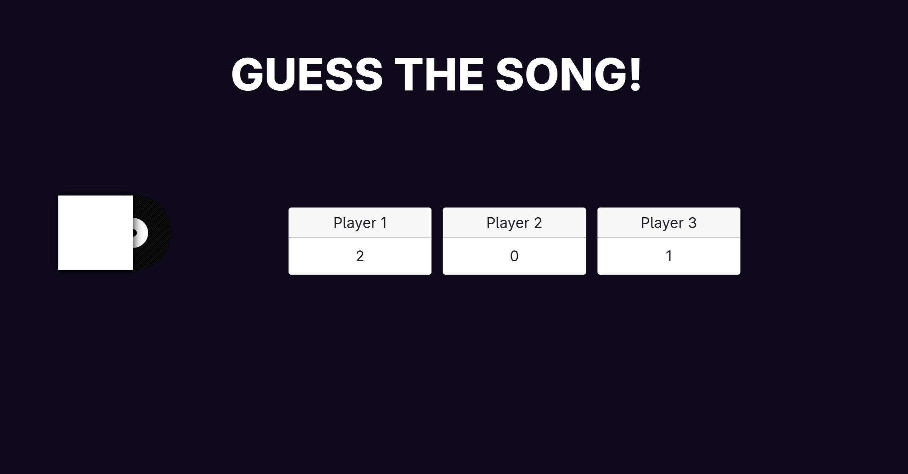

# Guess The Song
A web application where a group of people can play and see who can guess a given song the fastest!

## How to start
- Firstly change the address in the given config.js files in the frontend and backend directory
- Secondly in the backend/ folder create a file named .env and include the client id and client secret you get from the [Spotify Developer Dashboard](https://developer.spotify.com/dashboard) after creating an application there.
- Create the file with the following format:
```
CLIENT_ID={your id here}
CLIENT_SECRET={your secret here}
```
- Thirdly, set a session secret
```
SESSION_SECRET={any long string}
```
Lastly start up the frontend and backend

### Booting the server
- Navigate to the frontend folder and build the frontend
```
cd frontend
npm run build
```
- Navigate to the backend and start the server, the backend will serve the frontend automatically
```
cd backend
node index.js
```

## How to play
This game is meant to be played as a small party game.
The host opens the web application and logs in via their Spotify account. After entering a username, a lobby is created, this lobby URL can then be sent to the other players (at least 2 players are needed to start a game). After the at least two players join the game, the host can start the game and search for a song of their choosing. After pressing submit, the game starts and the players have to guess which song is currently playing (optionally include the artists). The player that first buzzes in gets to guess. The host can then decide whether the guess was right or wrong. If the guess was right, the player gets 1 point. If it is incorrect, the song continues. Each player can only guess once per round. 

